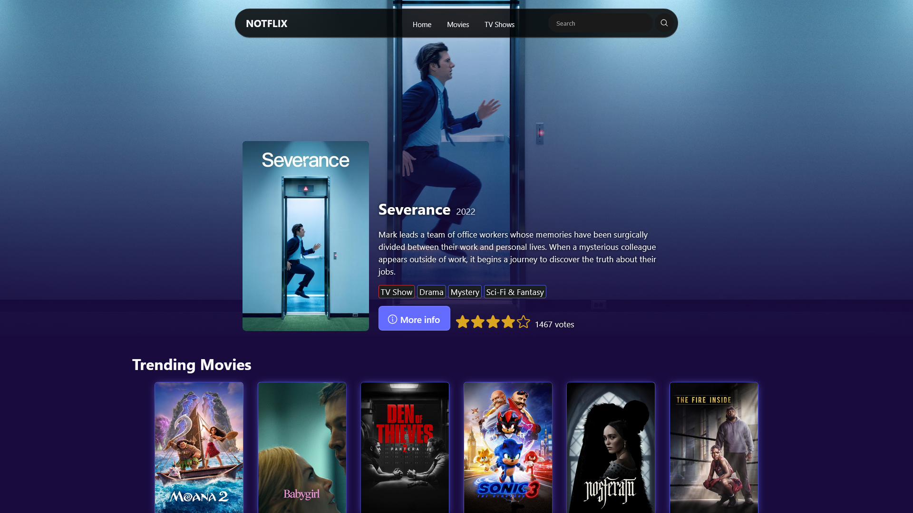
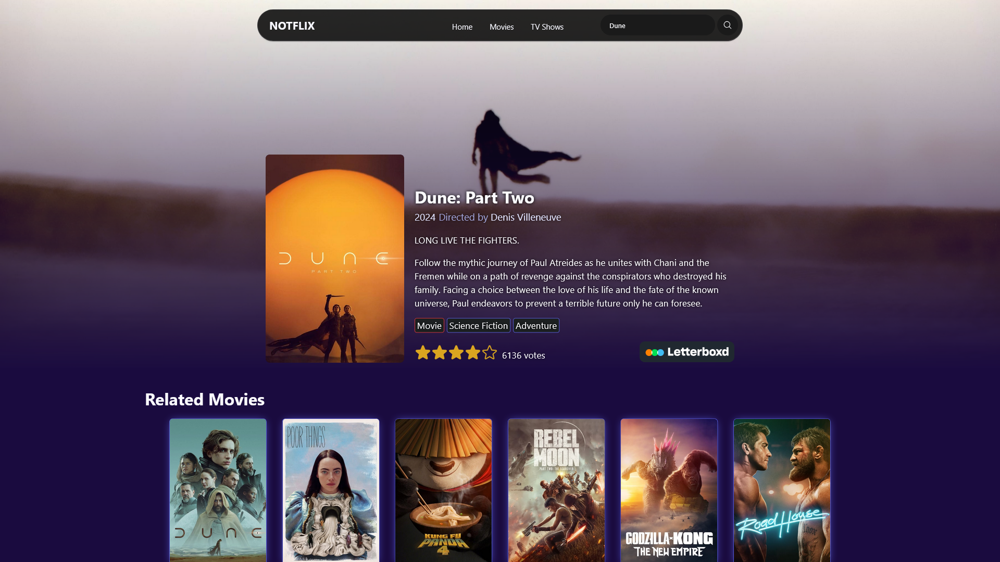

# 🍿Notflix

## Table of contents

- [Overview](#overview)
  - [Screenshots](#screenshots)
  - [Links](#links)
- [My process](#my-process)
  - [Built with](#built-with)
  - [Useful resources](#useful-resources)
- [Author](#author)

## Overview

Movie and TV show web app. See what is trending, who it is directed by and how well it is reviewed. There are more features on the way that will more fully utilize the wealth of data that the Movie Database API provides.

This is the first larger React app I've developed. It has been a challenge thus far but one that is incredibly rewarding to work through. I'm learning something new every time I work on it and it is improving just as much as I am. It's cool to see.

More to come...

### Screenshots

#### Home Page:

#### Details Page:

### Links

- [Live Site URL](https://creightoneli.github.io/notflix/)
- [React Docs](https://react.dev/reference/react)
- [Vite Docs](https://vite.dev/guide/)
- [Phosphor Icons](https://phosphoricons.com/)
- [The Movie Database](https://www.themoviedb.org/)
    - [TMDB API Docs](https://developer.themoviedb.org/docs/getting-started)

## My process

### Built with

- React
- React Router
- Vite
- The Movie Database API
- Semantic HTML5 markup
- CSS custom properties and SCSS
- A fair amount of JavaScript
- Phosphor Icons

## Author

- Website - [Elijah Creighton](https://creightoneli.github.io/)
- LinkedIn - [Creightone](www.linkedin.com/in/creightone)
