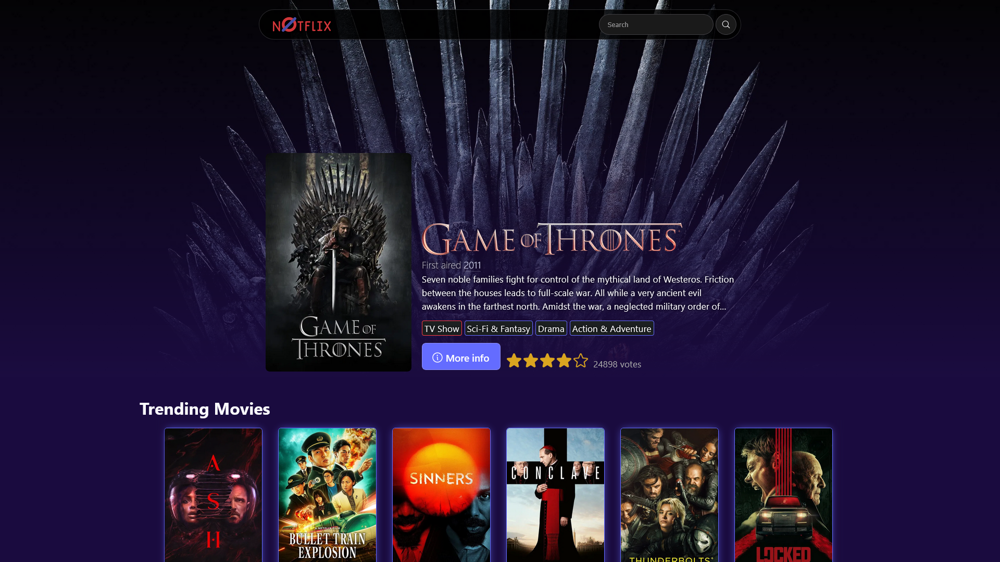
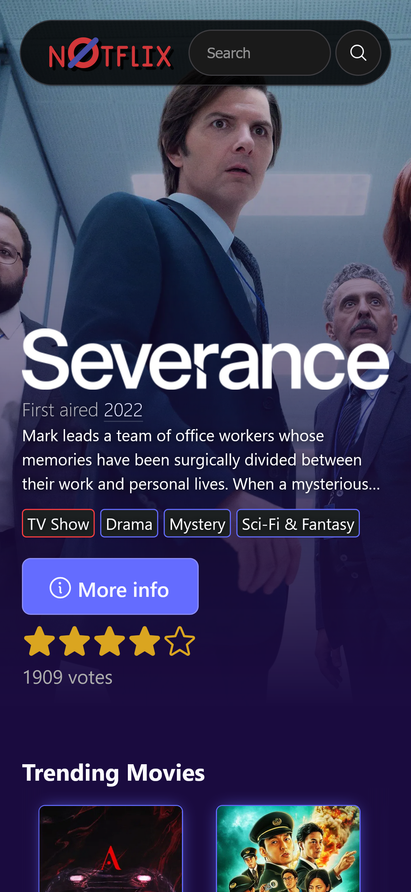

# Nullflix

## Table of contents

- [Overview](#overview)
  - [Getting Started](#getting-started)
  - [Screenshots](#screenshots)
  - [Links](#links)
- [Built with](#built-with)
- [Author](#author)

## Overview

Movie and TV show web app. See what is trending, who it is directed by and how well it is reviewed. You can search for just about anything, filter by media type or by genre, and learn more about the people who make movies happen by reading their biography or scrolling through their filmography.

### Getting Started:

Before you can use Nullflix there is a bit of setup you may need to do.

1. In order to use Nullflix you first need to register your API key with the Movie Database. [Here](https://developer.themoviedb.org/docs/getting-started)'s a link to get you started.

2. Once you have the key you can submit it on the website. Your API key is saved locally in your browser and used by it to make all the necessary API calls.

3. Finally, I highly recommend you only access this site with a solid adblocking extension like [uBlock Origin](https://github.com/gorhill/uBlock). I don't put ads on the site myself but many of the video providers inject ads into their services which are used on the site. In order to avoid dealing with annoying pop-ups please install a decent adblocker.

That's about all you need to do to enjoy Nullflix.

### Screenshots:

#### Home Page

### Links:

- [React Docs](https://react.dev/reference/react)
- [Vite Docs](https://vite.dev/guide/)
- [Phosphor Icons](https://phosphoricons.com/)
- [The Movie Database](https://www.themoviedb.org/)
  - [TMDB API Docs](https://developer.themoviedb.org/docs/getting-started)

## Built with

- React
- React Router
- Vite
- The Movie Database API
- Semantic HTML5 markup
- CSS custom properties and SCSS
- An immense amount of JavaScript
- Phosphor Icons
- Various online video providers

## Author

- Website - [Elijah Creighton](https://creightoneli.github.io/)
- LinkedIn - [Creightone](www.linkedin.com/in/creightone)
